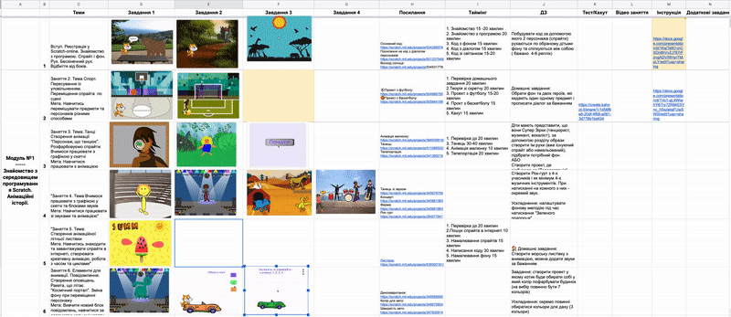

# Адаптація викладачів в GoITeens
Вітаю тебе, викладаче GoITeens!
Наша з тобою основна задача - це підготувати майбтніх ІТ-інженерів та технологічних підприємців. Це наша конкурентна перевага в глобальному світі - якість ІТ-освіти: сучасні технолгії, лідерство та дух підприємництва.   
    
В основі всіх курсів GoITeens лежить проектний підхід до навчання, всі курси - базуються на проектах (Project Based Courses.

Це означає, що в результатом оволодіння певної теми є виконання начального/практичного проекту, який узагальнює знання та навички, отримані в процесів вивчення відповідної теми.

Для того, щоб якісно підготувати себе до ведення занять - дуже важливо розуміти до якого проекту ви будете готвувати студентів. 
Для кожного рівня навчання (значний проект студенти роблять 1 раз на семестр/5 місяців).  Також в навчальних матеріалах ви знайдете навчальні завдання, які є практичиними елементами, що їх необхідно опрацювати зі студентами в процесі вивчення теми.
* **Проект** - це підсумкове завдання в якому є значна частина самостійної роботи студентів (від вибору теми до технічної реалізації). Проекти виконуються 1 раз на семестр (5 місяців).
* **Модульна робота** - це підсумкове завдання, що підсумовує вивчення певної теми (модуля), зазвичай проводиться 1 раз на місяць (4 тижні).
* **Практичні завдання на занятті** - це ті дії, які ви виконуєете на заняттях разом зі студентами.

## Проекти

Типові проекти та завдання - доступні для ознайомлення. І перед стартом вам необхідно, як мінімум, розгорнути та запустити проект, який буде базовим для виконання студентами після проходження занять впродовж семестру.  Це необхідно для того, щоб ви сформували бачення результату навчання впродовж семетру.

## Пробне заняття
Всі студенти GoITeens перед тим, як попасти в навчальну групу проходять пробне заняття: це цікаві практичні завдання, які розкривають суть курсу. Для розуміння того, на що налаштовані студенти, які проходять до вас на перше заняття дуже важливо пройти самостійно пробне заняття за вашим курсом.  
*Скрінкаст проведення пробного заняття зазвичай є пробним завданням при проведенні відбору на ведення занять в GoITeens*

## Структура занять
В GoITeens ми навчаємо через практику. Тобто перше, що необхідно зробити на навчанні - це зацікавити студента, показати йому як реалізувати ті чи інші практичні речі в обраному технологічному середовищі. Після того, як студенти змогли скопіювати та запустити в себе матеріал занять важливо, щоб вони розібралися як він працює (які параметри на що впливають), змогли кастомізувати програму під виконання типового завдання та із тим завданням, що визначається особливостями конкретного студента (ім'я, вік, вподобання, тощо). І в результаті - щоб студенти змогли використовувати технологію, що вивчається на занятті для реалізації власних ідей (самі собі поставити завдання та реалізувати).  
Теоретичне розуміння в такому випадку необхідно в більшій мірі для того, щоб студент зміг описати те, що він вже зробив.

Відповідно до цієї схеми роботи структура занять: 70% - практика, 20% - зворотній зв'язок (продвивтись те, як студенти зробили заняття), 10% - теорія (як описати словами те, що зробили студенти).

Для реалізації даної концепції в матеріалах для занять є наступні типи завдань.
1. **Базове завдання** - те завдання, яке виконує викладач зі студентами на заняттях. Зазвичай в матеріалах виконання такого завдання описано достатньо детально в форматі скріншотів. Базові завдання необхідні для того, щоб студент зміг запустити його на власному ком'ютері та пересвідчитися в тому, що відповідна технологія працює саме в нього.
2. **Додаткові завдання** - це завдання для виконання якого необхідно змінити параметри базового завдання (координати, колір, тип матеріалу, тощо). Додаткові завдання необхідні для того, щоб студент зрозумів структуру матеріалу (в тому числі - завдяки підбору необхідних параметрів та завдяки цьому - формування зв'язку між параметрами та результатами).
3. **Творчі завдання** - це завдання, в яких параметри для задачі не записани статично, а обираються самим студентом. Ці завдання необхідні для того, щоб студент зрозумів, що дана технологія може бути кастомізована під завдання, що пов'язані безпосередньо з ним.
4. **Супер-творчі завдання** - це завдання, в яких визначається тільки напрям роботи, що дозволяє використати технології, яка вивчалася на занятті, все інше - визначаєця студентом. Ці завдання необхідні для того, щоб студент використав технологію, яку вивчив для реалізації власної ідеї.

## Зворотній зв'язок
Кожна група різна. І зворотній зв'язок від викладача - що встигли, що - не встигли, це дуже важлива інформація. Тому ми просимо надсилати звортній зв'язок стосовно результатів занять, розроблених вами заняттями.

https://forms.gle/fJMysjM24kBKitvGA 

## Матеріали для занять
Для зручності викладачів матеріали для занять сформовані в таблиці: 
