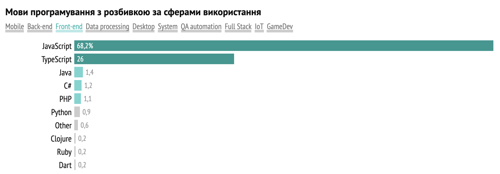
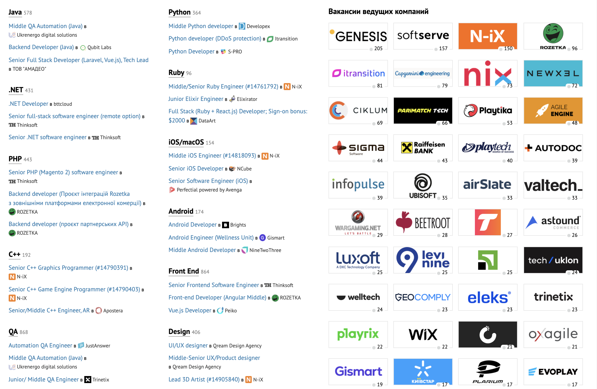

# Digital-мир
## Аутсорсинг и продукт
Для того, чтобы обучать ИТ-очень важно понимать, а как же происходит разработка программного обеспечения в современных ИТ-компаниях.  
По структуре разработка ПО мало чем отличается от других сфер: от строительства или от работы конструкторского бюро. Безусловно, есть свои отличия, но очень хорошо разобрать этот вопрос на примере аналогии с известными сферами.  
Например, строительство.  
Как происходит постройка дома?  
Есть заказчик - бизнесмен. Он хочет получить прибыль и приходит в строительную компанию и заказывает у нее строительство дома с заданными им параметрамами (в данном случае - строительная компания будет подрядчиком, т.е. аутсорсером).  
Второй вариант, когда строительная компания и ведет бизнес и строит, т.е. у нее есть продукт (постройка домов), который является ее бизнесом, при этом она же и занимается созданием этого продукта (на ИТ-терминалогии такая компания будет продуктовой).  

**Какой формат лучше?**
У каждого есть свои особенности.  
Например аутсорсинговой компанией стать достаточно просто, некоторые компании вырастали из одного человека, который постепенно нанимал новых сотрудников.  Минусом аутсорсинговых компаний можно считать то, что они реализуют проекты заказчиков, а это значит, что уровень добавленной стоимости у таких компаний ниже чем у продуктовых.  Таких компаний - большинство. При этом по аутсорсинговой модели работают в том числе самые большие компании: Epam, Soft Serve, т.д.  У аутсорсинговых компаний подавляющее большинство сотрудников это разработчики.  
Продуктовые компании - это компании, которые сами создают продукт, занимаются выводом его на рынок: маркетингом, продажами, сервисом. В таких компаниях, кроме штата разработчиков значительную часть составляют маркетологи и специалисты по продажами.  
Ориентировочное отношение продуктовых компаний к аутсосинговым - 80/20.  
Ajax: https://www.youtube.com/watch?v=4MTKknjyeAE  
GlobalLogic: https://www.youtube.com/watch?v=4lR3Mfu3z40   
Вопрос: какие из ТОП-20 компаний в Украине продуктовые:  
 

 Более подробно - лучше познакомиться на сайте DOU в разделе [ТОП-50](https://dou.ua/lenta/articles/top-50-summer-2021/?from=doufp)

## Жизненный цикл разработки программного обеспечения.
Существует [6 стадий жизненного цикла](https://vc.ru/u/700268-marketing-solveit/199225-chto-takoe-zhiznennyy-cikl-razrabotki-po-i-kakie-problemy-voznikayut-na-kazhdom-etape-sdlc) разработки Программного обеспечения:
1. Сбор и анализ требований (Planning and Requirement Analysis)
2. Документирование требований (Defining Requirements) 
3. Дизайн (Design the Product Architecture)
4. Разработка ПО (Building or Developing the Product)
5. Тестирование (Testing the Product)
6. Внедрение и поддержка продукта (Deployment in the Market and Maintenance)

## ИТ-специальности
В ИТ есть различные специальности: как технические, так и не технические.  
Среди специальностей можно выделить **команду разработки** (участвуют в создании программного обеспечения), **команду маркетинга и продаж** (они обеспечивают рекламу и продажи разработанного ПО), **команду сервиса** (обеспечивают взаимодействие с клиентами), **команду по подбору кадров** (ищут кадры, необходимые компании).   
С точки зрения ИТ-направления важно рассматривать именно команду разработки.

### Команда разработки
|№|Название|Описание|
|---|---|---|
|1|Бизнес-аналитик (BA)|Продумывает бизнес-логику приложения, управляет требованиями, контролирует показатели приложения. Отвечает за то, что приложение будет пользоваться популярностью. Готовит (прописывает) бек-лог для спринта команды.|
|2|Руководитель проектов (PM)|Отвечает за сроки, качество, бюджет проекта и уровень счастья команды на проекте.|
|3|Дизайнер|Создает графические решения проекта|
|4|Программист (разработчик)|Создает программный код|
|5|Инженер по качеству (QA)|Контролирует уровень качества разработки, проверяет соответствие техническому заданию.|
|6|Специалист по работе с данными (Data Scientist)|Создает DS-модели: анализирует данные и делает прогнозы|

Если описать это в ролях, то все начинается с **заказчика**. Чаще всего - это предприниматель, который хочет получить прибыль и для этого создать то или иное программное обеспечение. Заказчик обращается в ИТ-компанию и начинает общаться **с менеджером по продажам** (Sales). Это соответствует **стадии 1.** В результате взаимодействия происходит заключение договора с заказчиком и более детальный сбор и анализ требований. После **Sales** (после подписания договора) за проект обычно берется BA (бизнес-аналитик). Его задача собрать все требования от заказчика (стадия 1) и документировать их (стадия 2). В течение всего проекта бизнес-аналитик работает с командой, являясь как бы "аватаром заказчика" в команде: именно он принимает решение как реализовывать бизнес-логику приложения.  
  
Когда требования собраны и задокументированы разработка переходит на **стадию 3** - дизайн, более точно данный этап можно назвать как проектирование. Т.е. на этом этапе происходит проектирование архитектуры программного обеспечения. Обычно этим занимается архитектор (**archtect**) либо тех. лид (tech lead), т.к. выбор и проектирование архитектуры приложения является крайне важным этапом разработки ПО и влияет на все последующие этапы.  
Когда приложение спроектировано происходит переход в **стадию 4**: непосредственно разработка ПО.  
Командой разработки на этом этапе начинает руководить менеджер проекта (**Project Manager**).  Он занимается организацией работы участник  

Для наглядного примера можно рассмотреть разработку Интернет-приложения: после проектирования происходит переход к созданию дизайна (**UI/UX дизайна**): разрабатывается схема расположения элементов в интерфейсе, а также создается (рисуется) сам интерфейс. На выходе мы будем иметь графическое решение приложения.  

После того, как создан дизайн - этот дизайн можно сверстать и подключить к нему **FrontEnd**-программную часть (будут созданы программы для интерфейса).  
Создание диазайна, его верстка и написание кличентской программы - это разработка будущего интефеса программного обеспечения.  
Второй важно составляющей частью является разработка серверной части приложения (**BackEnd-разработка**). При этом в серверной части могут быть досбавлены элементы анализа данных и искусственного интеллекта (работа Data Scientist).

После того, как заканчивается разработка интерфеса и серверной части разработка программного обеспечения переходит к **стадии 5** - тестирование. На 
этом этапе индерены по качеству (**QA-engeneering**). Эти специалисты проверяют соответствие разработки изначальному проекту.

После того, как проект будет успешно протестирован и реализован происходит переход на **6 стадию**: внедрение и подержка разработанной программы для пользователя.

У нас есть (мы познакомились) с компаниями и основными должностями в ИТ.

Далее - мы познакокмимся с направленияит разработки.  Направления разработки отличаются тем, на каком языке пишет программист.

|№|Направление разработки|Описание|Типовые проекты|Языки программирования|
|---|---|---|---|---|
|1|FrontEnd|Создание интерфейсов Web-приложений: посадочных страниц, интерфеса сайтов на CMS, др.|Сайт для малого бизнеса, личный сайт специалиста, сайт компании или общественной организации, Интернет-магазин|HTML+CSS, JavaScript|
|2|BackEnd|Создание серверной части сайтов и web-приложений. Создание ботов в меседжерах|парсер цен и показателей, каталог фильмов, учет финансов. Создание плагинов к CMS. Телеграм-бот|Java, C#, PHP, Python|
|3|Mobile|Создание сложных мобильных приложений (функицонал простых приложений проще и дешевле реализовать в Web-стеке). |Игры, обучающие приложения, месендежры, др.|Kotlin, Swift|
|4|GameDev|Создание игр: программирование и 3D-моделирование|Квесты, RPG, RTS| Roblox(Lua), Unity (C#), C++|
|5|IoT|Создание  embedded-систем|Системы умного дома, безопасности, бытовая техника, вендинговые аппараты, др.|C,C++,Python|
|6|Data Processing|Обработка данных: анализ данных, системы искусственного интеллекта, др. |Программы анализа данных, программы для прогнозирования|Python|

Также можно выделить несколько направлений, которые не относятся к разработке непосредственно, но интересны с точки зрения изучения:
|№|Направление разработки|Описание|Языки программирования/технологии|
|---|---|---|---|---|
|1|Blogging|Создание информационного канала: youtube-канал, подкаст|Запись видео, монтаж, размещение на youtube|
|2|IT-education|Создание образовательного продукта|Minecraft Education, Scratch|

В таблицах, приведеных выше указываются основные языки программирования. При желании - вы можете посмотреть, какие библиотеки используются для языков программирования и в целом определить требования к современным разработчикам в разделе "Работа" портала Dou.  

## Project Based Course

**Цель нашего курса** - внедрить проектный подход в обучении по уже существующим программам. Для этого нам необходимо выбрать технологию, которая позволяет раскрыть материал программы, а также подобрать такую форму и цель проекта, которая будет понятна и интересна ученикам с одной стороны и будет иметь общественную ценность.

Но для каждого направления нужен **проект**. Понятнее всего, когда этот проект является локальной реализацией уже работающего сервиса: на примере сервисов, которые можно использовать ежедневно разберем приниципы работы каждого из технологических стеков.  Но также один из вариантов создания проектов - создание продукта в соответствующем технологическом стеке с использованием сервисов в том числе с использованием технологии nocode.

|№|Направление разработки|Сервисы для типовых проектов|
|---|---|---|
|1|FrontEnd|https://tilda.cc/   https://wordpress.com/  |
|2|BackEnd|https://botmother.com/ (телеграм-бот)   https://www.octoparse.com/ (парсинг)   https://www.sheet2site.com/ (сайт с данными)  |
|3|Mobile|https://www.plickers.com/   https://appsgeyser.com/  |
|4|GameDev|https://gdevelop-app.com/   https://www.kodugamelab.com/   https://torque3d.org/   https://www.renpy.org/   https://make.gamefroot.com/   |
|5|IoT|https://teachablemachine.withgoogle.com/    |
|6|Data Processing|https://www.dataddo.com/platform   https://quickdraw.withgoogle.com/   https://www.autodraw.com/   https://thisresumedoesnotexist.com/#Pasquale    |
|7|Design|https://piktochart.com/   https://www.canva.com/   https://www.figma.com/   https://logojoy.com/  https://www.remove.bg/ru |
|8|Programming4kids|https://blockly.games/puzzle?lang=ru    https://catrobat.org/our-apps/    https://www.figma.com/   https://logojoy.com/  https://www.remove.bg/ru |

Реализовать первую версию проекта в том числе, чтобы протестировать идею и сделать после этого качественные прототипы намного быстрее использовать сервисы по соответствующим технологиям.

### Как выбрать проект?
Для того, чтобы определить тот проект, который вы будете реализовывать необходимо, в первую очередь, определиться с целями: - под какую программу вы хотите реализовать проект? - какая технология в этом подойдет? - что именно из того, что возможно к реализации в рамках данной технологии, вам интересно реализовать.

**Идея проекта** - это самое важное в проекте. Это важное утверждение: основным является именно ваши цели и ваши желания, а технологии лишь предоставляют возможность реализовать ваши цели и желания. Т.е. если вы идею своего проекта сможете качественно зафиксировать, пусть даже на обычном листе бумаги, у такого проекта есть значительные шунсы на успех. В обратном случае - даже если вы будете знать технологии досконально, но идея будет отсутствовать. Именно поэтому очень важно - уделить формулированию идеи вашего проекта достаточно большое количество времени.

**Мотивация использования проекта** - для того, чтобы уточнить вашу идею очень важно описать ценность проекта: для участников проекта, для клиентов проекта, общественную и бизнес-ценность, а также ценность для вас как для разработчика и руководителя проекта.  
При этом мотивацию важно расписывать в двух аспектах: что проект дает позитивного (увеличение ресурсов, формирование качеств и навыков) и что он убирает негативного (например: хорошее образование вытесняет посредственное, занятие программированием вытесняет вредное времяпрепровождение и т.д.).

## Задания:
1. Зарегистрироваться в файле для регистраций:
2. Перечитать конспект.
3. Заполнить "Чек-лист по созданию проекта"