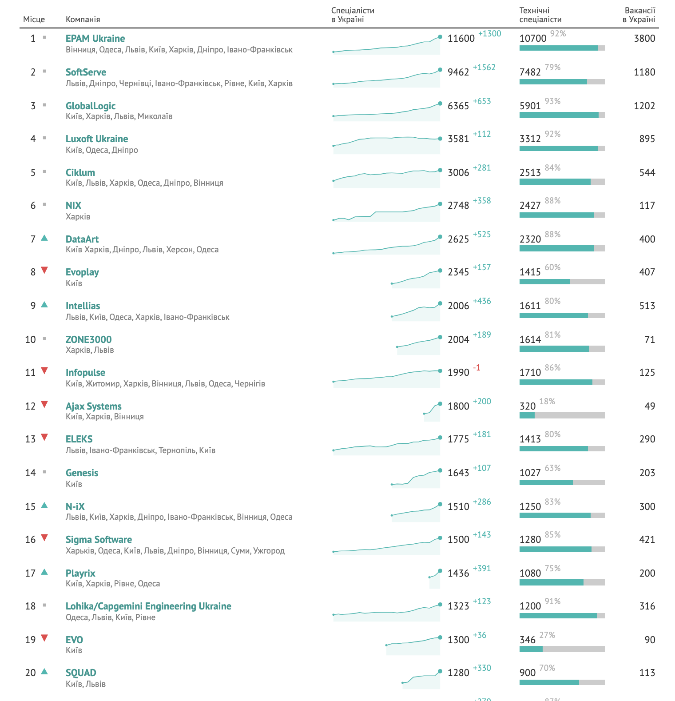

# Digital-мир
## Аутсорсинг и продукт
Для того, чтобы обучать ИТ-очень важно понимать, а как же происходит разработка программного обеспечения в современных ИТ-компаниях.  
По структуре разработка ПО мало чем отличается от других сфер: от строительства или от работы конструкторского бюро. Безусловно, есть свои отличия, но очень хорошо разобрать этот вопрос на примере аналогии с известными сферами.  
Например, строительство.  
Как происходит постройка дома?  
Есть заказчик - бизнесмен. Он хочет получить прибыль и приходит в строительную компанию и заказывает у нее строительство дома с заданными им параметрамами (в данном случае - строительная компания будет подрядчиком, т.е. аутсорсером).  
Второй вариант, когда строительная компания и ведет бизнес и строит, т.е. у нее есть продукт (постройка домов), который является ее бизнесом, при этом она же и занимается созданием этого продукта (на ИТ-терминалогии такая компания будет продуктовой).  

**Какой формат лучше?**
У каждого есть свои особенности.  
Например аутсорсинговой компанией стать достаточно просто, некоторые компании вырастали из одного человека, который постепенно нанимал новых сотрудников.  Минусом аутсорсинговых компаний можно считать то, что они реализуют проекты заказчиков, а это значит, что уровень добавленной стоимости у таких компаний ниже чем у продуктовых.  Таких компаний - большинство. При этом по аутсорсинговой модели работают в том числе самые большие компании: Epam, Soft Serve, т.д.  У аутсорсинговых компаний подавляющее большинство сотрудников это разработчики.  
Продуктовые компании - это компании, которые сами создают продукт, занимаются выводом его на рынок: маркетингом, продажами, сервисом. В таких компаниях, кроме штата разработчиков значительную часть составляют маркетологи и специалисты по продажами.  
Ориентировочное отношение продуктовых компаний к аутсосинговым - 80/20.  
Ajax: https://www.youtube.com/watch?v=4MTKknjyeAE  
GlobalLogic: https://www.youtube.com/watch?v=4lR3Mfu3z40   
Вопрос: какие из ТОП-20 компаний в Украине продуктовые:  
 

 Более подробно - лучше познакомиться на сайте DOU в разделе [ТОП-50](https://dou.ua/lenta/articles/top-50-summer-2021/?from=doufp)

## Жизненный цикл разработки программного обеспечения.
Существует [6 стадий жизненного цикла](https://vc.ru/u/700268-marketing-solveit/199225-chto-takoe-zhiznennyy-cikl-razrabotki-po-i-kakie-problemy-voznikayut-na-kazhdom-etape-sdlc) разработки Программного обеспечения:
1. Сбор и анализ требований (Planning and Requirement Analysis)
2. Документирование требований (Defining Requirements) 
3. Дизайн (Design the Product Architecture)
4. Разработка ПО (Building or Developing the Product)
5. Тестирование (Testing the Product)
6. Внедрение и поддержка продукта (Deployment in the Market and Maintenance)

Если описать это в ролях, то все начинается с **заказчика**. Чаще всего - это предприниматель, который хочет получить прибыль и для этого создать то или иное программное обеспечение. Заказчик обращается в ИТ-компанию и начинает общаться **с менеджером по продажам** (Sales). Это соответствует **стадии 1.** В результате взаимодействия происходит заключение договора с заказчиком и более детальный сбор и анализ требований. После **Sales** (после подписания договора) за проект обычно берется BA (бизнес-аналитик). Его задача собрать все требования от заказчика (стадия 1) и документировать их (стадия 2). В течение всего проекта бизнес-аналитик работает с командой, являясь как бы "аватаром заказчика" в команде: именно он принимает решение как реализовывать бизнес-логику приложения.  
Когда треюованы собраны и задокументированы разработка переходит на **стадию 3** - дизайн, более точно данный этап можно назвать как проектирование. Т.е. на этом этапе происходит проектирование архитектуры программного обеспечения. Обычно этим занимается архитектор (**archtect**) либо тех. лид (tech lead), т.к. выбор и проектирование архитектуры приложения является крайне важным этапом разработки ПО и влияет на все последующие этапы.  
Когда приложение спроектировано происходит переход в **стадию 4**: непосредственно разработка ПО.  
Командой разработки на этом этапе начинает руководить менеджер проекта (**Project Manager**).  Он занимается организацией работы участник  

Для наглядного примера можно рассмотреть разработку Интернет-приложения: после проектирования происходит переход к созданию дизайна (**UI/UX дизайна**): разрабатывается схема расположения элементов в интерфейсе, а также создается (рисуется) сам интерфейс. На выходе мы будем иметь графическое решение приложения.  
После того, как создан дизайн - этот дизайн можно сверстать и подключить к нему **FrontEnd**-программную часть (будут созданы программы для интерфейса).  
Создание диазайна, его верстка и написание кличентской программы - это разработка будущего интефеса программного обеспечения.  
Второй важно составляющей частью является разработка серверной части приложения (**BackEnd-разработка**). При этом в серверной части могут быть досбавлены элементы анализа данных и искусственного интеллекта (работа Data Scientist).

После того, как заканчивается разработка интерфеса и серверной части разработка программного обеспечения переходит к **стадии 5** - тестирование. На 
этом этапе индерены по качеству (**QA-engeneering**). Эти специалисты проверяют соответствие разработки изначальному проекту.

После того, как проект будет успешно протестирован и реализован происходит переход на **6 стадию**: внедрение и подержка разработанной программы для пользователя.

Мы познакомились с та