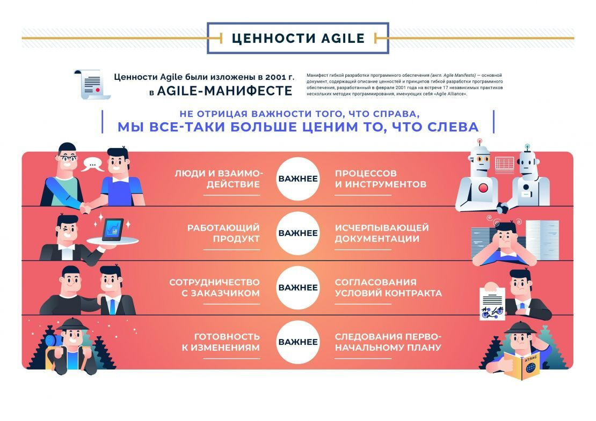
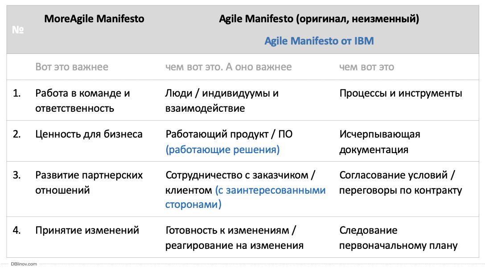
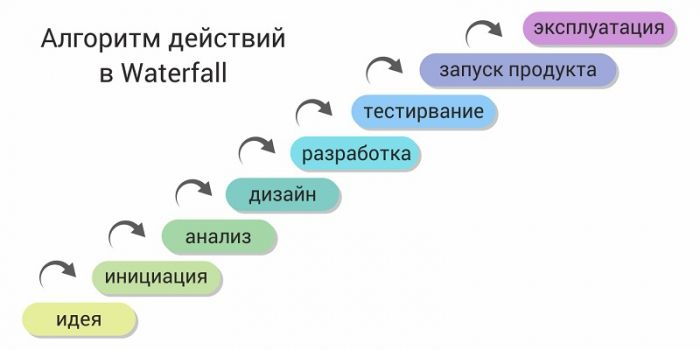
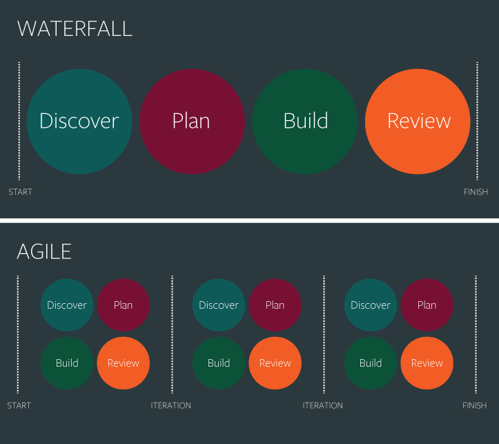
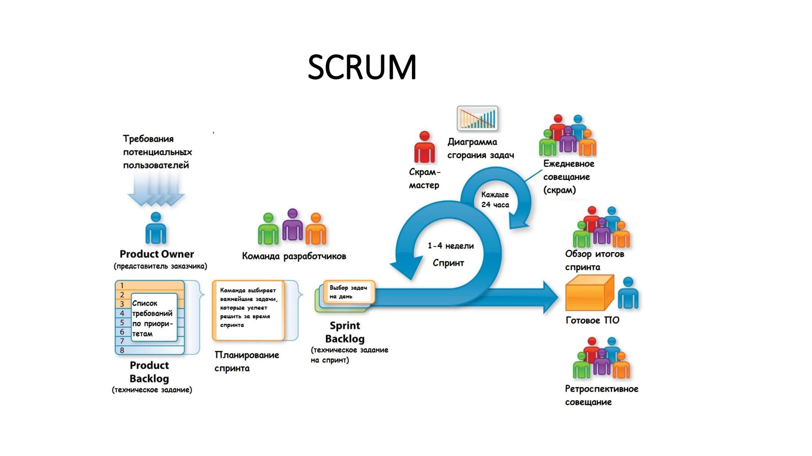
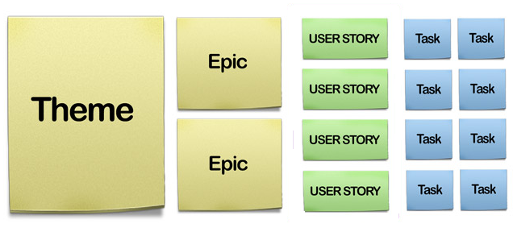
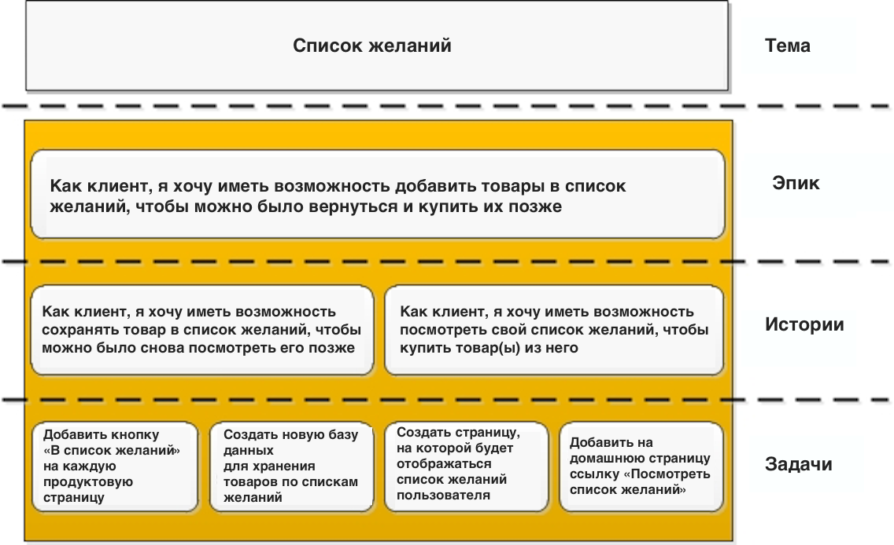
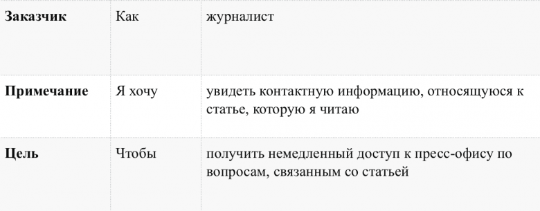

# Agile. Scrum
## Основы технологических стеков. 
В любом технологическом стеке есть стандартный алгоритм знакомства с технологией:
* Организация рабочего места: запуск редактора кода и возможность запускать соответствующий код
* Типовой код: простой код, который можно запустить и он показывает основную функциональность соответствующего технологического стека
* Набор задач, решив которые начинающий разработчик в данном технологическом стеке познакомится с основными особенностями
* Обзор типовых проектов: на примере которых вы сможете разобраться как создавать проекты

### Рабочее место
Можно выделить 2 типа рабочих мест: он-лайн и офф-лайн
* **офф-лайн рабочее место** - позволяет эффективно работать и быстро создавать программное обеспечение. Минусом такого варианта организации рабочего места могут быть сложности с настройкой программ на вашем локальном компьютере.
* **он-лайн рабочее место** - ограничивает скорость работы, но, гарантирует работу сервиса, т.к. она не зависит от операционных систем и настроек компьютера.

#### Он-лайн рабочие места по технологическим стекам

|№|Направление разработки|Сервисы для типовых проектов|
|---|---|---|
|1|FrontEnd|  https://replit.com/ , https://codepen.io/  |
|2|BackEnd| https://www.pythonanywhere.com/ (Python), https://schoolsw3.com/php/phptryit.php (PHP)  |
|3|Mobile|http://online.swiftplayground.run/ (Swift) https://play.kotlinlang.org/ (Kotlin) |
|4|GameDev| https://replit.com/ (C#),  |
|5|IoT| htps://www.pythonanywhere.com/ (Python) , https://thingsboard.io/  (IoT)  |
|6|Data Processing| htps://www.pythonanywhere.com/ (Python)    |
|7|Design| https://www.photopea.com/ |
|8|Programming4kids|https://blockly.games/puzzle?lang=ru    https://catrobat.org/our-apps/    https://www.figma.com/   https://logojoy.com/  https://www.remove.bg/ru |

https://iotji.io/solutions-ua/ 

#### Офф-лайн рабочие места по технологическим стекам
|№|Направление разработки|Сервисы для типовых проектов|
|---|---|---|
|1|FrontEnd| https://code.visualstudio.com/  |
|2|BackEnd| https://code.visualstudio.com/ , https://www.jetbrains.com/ru-ru/pycharm-edu/ , https://www.python.org/downloads/ (Python)    https://www.apachefriends.org/download.html  , https://ospanel.io/ ,  https://code.visualstudio.com/  |
|3|Mobile|https://www.jetbrains.com/objc/ , https://developer.apple.com/swift/ (Swift) , hhttps://www.jetbrains.com/idea/ (Kotlin) |
|4|GameDev| https://visualstudio.microsoft.com/ru/downloads/ , https://unity.com/ (C#),  |
|5|IoT| hhttps://code.visualstudio.com/ , https://www.jetbrains.com/ru-ru/pycharm-edu/ , https://www.python.org/downloads/ (Python)   |
|6|Data Processing| https://code.visualstudio.com/ , https://www.jetbrains.com/ru-ru/pycharm-edu/ , https://www.python.org/downloads/ (Python)     |
|7|Design| https://www.adobe.com/products/photoshop/free-trial-download.html , https://www.adobe.com/products/illustrator/free-trial-download.html , https://www.figma.com/ |

### Типовой код

* [FrontEnd (Tilda)](https://github.com/mikh-maksi/teachersup/tree/main/product/lesson02/fe_tilda)
* [FrontEnd (Создание сайта)](https://github.com/mikh-maksi/teachersup/tree/main/product/lesson02/fe)
* [Python (создание Телеграм-бота)](https://github.com/mikh-maksi/teachersup/tree/main/product/lesson02/python)
* [GameDev (C# - текстова игра)](https://github.com/mikh-maksi/teachersup/tree/main/product/lesson02/gamedev)
* [Design](https://drive.google.com/file/d/1SnSrA2AePeEHeya12BoKhNv2lo9wWQsU/view)

## Планирование проекта. 
Как спланировать проект?   
Основным вопросом, на который нужно ответить при планировании проекта является вопрос: "Какую проблему мы решаем?". Расписанный по пунктам ответ на этот вопрос будет первоначальным планом соответствующего проекта.  
После того, как мы ответили на вопрос о том, какую проблему мы решаем нам необходимо визуализировать работу реализуемого проекта необходимо **создать прототип** (макет). Самым простым инструментом прототипирования является листок и ручка, но также существует большое количество он-лайн сервисов, которые позволяют создать прототип: https://draw.io/ , https://www.figma.com/ , https://www.invisionapp.com/ .
После создания прототипа важным элементом является описание его функциональности. Для этого - важно проставить на прототипе номера зон и под соответствующими номерами **описать функционал**.
После описания функционала важно выделить **MVP** (minimum value product) - создание какого наименьшего набора элементов будет иметь ценность при сохранении концепции проекта.
Остальной список добавления функицональности должен учитывать расширение **MVP** - создавая дополнительную ценность с каждым новым релизом (добавлением элементов).

|#|Действие|Требование к описанию этапа|
|---|---|---|
|1|Какую проблему решаем?|1 предложение|
|2|Как решаем основную проблему?|последовательность действий|
|3|Какова структура проекта?|Список страниц/экранов проекта|
|4|Как будет выглядеть интерфейс проекта?|Созданные прототипы страниц/экранов  https://draw.io/ , https://www.figma.com/ , https://www.invisionapp.com/|
|5|Опишите функционал проекта|На прототипе указать цифрами основные функциональные элементы. Составить нумерованный список, в котором каждый элемент является описание функционального элемента, отмеченного цифрой на прототипе|
|6|Создание MVP|Опишите ту функциональность проекта, при реализации которой проект уже будет давать результат, но затраты на его реализацию будут минимальными|
|7|Опишите последовательность реализации проекта|Список функций, которые будут реализованы после реализации MVP.|

## Связь проекта с учебной программой. 
Желательно, чтобы проект, который реализуется, опирался на пункты учебной программы. Для этого важно - определить какие элементы позволят реализовать **MVP** и далее развивать его, добавляя такие блоки, которые позволяют отработать технологии, входящие в программу, но не используемые в **MVP**. 

## Основы менеджмента. 
**Менеджмент** - это направление знаний об управлении людьми (а также процессами и проектами в которых участвют люди).  
Менеджмент - это важный фактор достижения успеха, т.к. от качества менеджмента зависит объем ресурсов, необходимый для достижения поставленных целей.  В нашем курсе мы рассматриваем проекты, поэтому нам будет интересен такой подвид менеджмента как проектный менеджмент.   
  
Но до того, как мы перейдем к проектному менеджменту сделаем небольшой исторический обзор доминирующих концепций менеджмента. Если сильно упростить, то для управления разными группами людей необходимы разные подходы: для управления рабами - один, для управления солдатами - другой, для управления рабочими на заводе - третий, а для управления квалифицированными специалистами высокотехнологичных профессий - четвертый.  
Вторым фактором, который определяет развитие менеджмента является то, какие инструменты находятся в распоряжении менеджера и тут можно выделить 3 основные вехи: начало применение научных методов, начало применения вычислительных машин для принятия решений и начало получения информации непрерывно.   
Современный менеджмент как наука зародился в конце XIX, начале XX века в США, во время бурного роста промышленности. До второй мировой войны сформировалась школа Научного менеджмента, суть которой можно в общем описать как набор методов, позволяющий добиваться от человека максимального результата.  Тотальный контроль, учет, жесткое планирование, с которым сегодня еще очень часто сталкиваются в системе образования - это все элементы данной школы управления.  
Но сегодня основная добавленная стоимость переместилась в область творческой работы и такая работа стала массовой. А люди сложных и творческих профессий не могут показывать высокой эффективности при максимальном контроле, который, с другой стороны, может стоить примерно столько же, сколько стоит работа специалиста.  
Для управления профессиональными и мотивированными сотрудниками были разработаны гибкие методологии, которые базируются не на тотальном контроле, а на доверии к сотруднику в том, что он мотивирован, профессионален и честен.  
Такой подход работает только если сотрудники мотивированы, профессиональны и честны, иначе - для достижения результата необходимо применять другие методы.
## Манифест Agile. 

* Люди и взаимодействие важнее процессов и инструментов
* Работающий продукт важнее исчерпывающей документации
* Сотрудничество с заказчиком важнее согласования условий контракта
* Готовность к изменениям важнее следования первоначальному плану

То есть, не отрицая важности того, что справа,  
мы всё-таки больше ценим то, что слева.  

http://agilemanifesto.org/iso/ru/manifesto.html

Agile Манифест был принят в 2001 году. С тех пор появились некоторые дополнения. Вот одно из них: 
  

### Принципы применения Agile:
* Наивысшим приоритетом для нас является удовлетворение потребностей
заказчика, благодаря регулярной и ранней поставке ценного программного
обеспечения.

* Изменение требований приветствуется, даже на поздних стадиях разработки.
Agile-процессы позволяют использовать изменения для обеспечения заказчику
конкурентного преимущества.

* Работающий продукт следует выпускать как можно чаще, с периодичностью
от пары недель до пары месяцев.

* На протяжении всего проекта разработчики и представители бизнеса должны
ежедневно работать вместе.

* Над проектом должны работать мотивированные профессионалы. Чтобы
работа была сделана, создайте условия, обеспечьте поддержку и полностью
доверьтесь им.

* Непосредственное общение является наиболее практичным и эффективным
способом обмена информацией как с самой командой, так и внутри команды.

* Работающий продукт — основной показатель прогресса.

* Инвесторы, разработчики и пользователи должны иметь возможность
поддерживать постоянный ритм бесконечно. Agile помогает наладить такой
устойчивый процесс разработки.

* Постоянное внимание к техническому совершенству и качеству
проектирования повышает гибкость проекта.

* Простота — искусство минимизации лишней работы — крайне необходима.

* Самые лучшие требования, архитектурные и технические решения рождаются
у самоорганизующихся команд.

* Команда должна систематически анализировать возможные способы
улучшения эффективности и соответственно корректировать
стиль своей работы.

http://agilemanifesto.org/iso/ru/principles.html

## Процедуры и артефакты Scrum. 
Классическая последователь выполнения проекта, когда все его этапы идут один за одним и результат мы можем получить/оценить только после окончания преокта. Например - строим большой дом или завод.  
В сфере информационных технологий, с одной стороны, могут очень часто изменяться требования, с другой - можно намного быстрее создавать продукт, которым могут воспользоваться пользователь.  
* Идея
* Инициация
* Анализ
* Дизайн (проектирование)
* Разработка
* Тестирование
* Запуск проекта
* эксплуатация

Но т.к. среда изменяется достаточно часто, то и весь процесс должен происходить не один раз, а регулярно в течении 1-2 недель

## Scrum
**Agile** - это набор принципов. Для эффективного применения данных принципов необходимо организовать процесс так, чтобы он соответствовал принципам.  Для описания организации работ используются фреймворки.  Одним из самых распространенных Agile-фреймворков является **Scrum**.

Для того, чтобы запустить Scrum, необходимо подготовить список задач.  Для того, чтобы отдельный разработчик начал писать код ему нужна отдельная задача (task), но для того, чтобы сформулировать отдельную задачу необходимо спустить от общего (идеи проекта) к частному: конкретной задаче. Такой процесс в фреймворке Scrum - детализирован и описан:

При этом - каждый из элементов: хорошо описан

**Эпик** (Epic) — это объем работы, который можно разбить на несколько отдельных заданий (так называемых «пользовательских историй») в зависимости от потребностей или запросов клиентов или конечных пользователей.

**User Story** — это короткая формулировка намерения, описывающая что-то, что система должна делать для пользователя.

Для начала работы по **Scrum** нам необходимо выписать список требований будущего проекта.  А затем - приоретизировать их.  Приоретизированный список требований назвается беклог. Для того, чтобы требования вели к результату были разработаны специальные техники их описания, например требований в формате **User Story**.

## Таск-трекер Trello.
Для отображения показателей используются различные таск-трекеры. Один из самых распространенных трекеров для начинающих - [Trello](https://trello.com/).

**Задача:**
* Описать проект в целом
* Выделить основные эпики.
* Первый эпик - расписать по User Story
* Разместить User Story в таск трекере.
* Члены команды - разбирают User Story на следующий период.