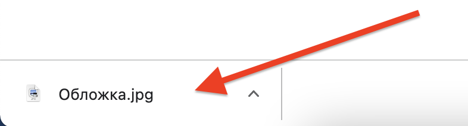

# FrontEnd junior

- <a href = "https://tilda.cc/ua/">https://tilda.cc/ua/</a>, <a href="https://tilda.cc/ru/">https://tilda.cc/ru/</a>    
  
  

- Создаем сайт  
  

- Выбираем шаблон "Курсов английского"  
  
  

- Берем изображения из <a href = "https://drive.google.com/drive/folders/1ngZB9iwM7qHMNKHVkHpDIHfbhXJMdhPs">заготовок</a>.  
   
   

- На сайте нажимаем кнопку "контент"  
   

- Удаляем текущий фон  
   

- Загрузить файл из заготовок  
   
  
   
  
  

- Взять данные из <a href = "https://docs.google.com/document/d/1576rjttwfGhqxPxL27Mwmmg6AOyix8WosH9dCQdQmtY/edit">заготовленного документа</a>:  
  
  
  

- Опубликуем созданный сайт:  
  
  
  
  

