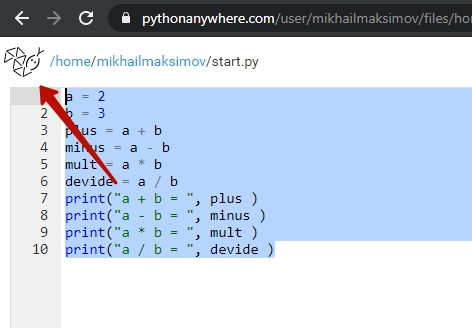

# Пробное занятие по Python
## Вступление
**Что такое Программирование?**  
Это сфера написания компьютерных программ.  
**Что такое компьютерные программы?**  
Это инструкции для компьютера, которые он умеет выполнять!
**Почему программирование хорошо оплачивается?**
Потому что одна программа заменяет большое количество людей длительное время. Первые программы писались для расчетов. В итоге 1 программа заменяла работу целого отдела математиков. В итоге - это позволяет хорошо оплачивать труд создателей программ.  
Принцип сохранился: программы заменяют людей, только расширились сферы применения:  
* Расчеты
* Учет
* Продажи
* Презентации
* Игры

А в последние несколько лет стало очень актуальным направления сбора и анализа данных и принятия, на основании этих данных решений. Т.е. компьютеры "научились" практически всему что умеют люди, программы искусственного интеллекта даже копируют структуру нашего мозга создавая искусственные нейронные сети, использующие тот же принцип работы, что и нейронные сети в мозгу человека.  
Чтобы понимать компьютеры очень помогают аналогии с людьми. Это хорошо работает, т.к. компьютеры созданы по примеру человека. У нас с ними похожая структура.  
А языки программирования и их использование похожи на использование человеческих языков. Английский - удобен для проведения переговоров по всему миру. Можно сказать, что это язык общего назначения. Но для того, чтобы жить и общаться, скажем - в Словакии. Лучше подойдет словацкий язык: коммуникация на нем с жителями Словакии будет происходить намного быстрее.  В то же время английский в Ирландии, Британии, США для повседневного общения подходит лучше других.
Так и языки программирования - каждый удобен для использования в определенной сфере. Python - это, как английский, может быть использован в большом количестве сфер, но есть те сферы, в которых он справляется лучше других: анализ данных, создание систем искусственного интеллекта и Web-программирование.  
### Как работают программы?
Программу можно представить в виде здания, которое выполняет определенную функцию: это может быть жилой дом, больница или офисный центр. Здания - состоят из кирпичиков, а программы состоят из команд (инструкций) для компьютера. А также из управляющих конструкций - которые говорят когда какие инструкции выполнять и переменных, которые хранят значения, которые программа обрабатывает. Т.е. инструкции - это как кирпичики, управляющие конструкции - это как указатели куда можно ходить (какие помещения из кирпичиков использовать), а переменные - это люди, которые ходят по помещению.
### Давайте попробуем?
У программистов есть традиция начинать изучение языка программирования с вывода строки `"Hello, world!"` - этой традиции уже 42 (!) года. Не будем изменять этой традиции.
Для того, чтобы вывести строку `"Hello, world!"` на языке программирования `Python` необходимо написать команду `print`:
```python
print("Hello, world!")
```
## Основы программирования
### Среда запуска. Первая программа.
**Понимает ли компьютер язык программирования на прямую?**  
Нет! Компьютер понимает исключительно машинный код. Машинный код - это набор 0 и 1.  
  
Чтобы перевести с языка программирования на "машинный" используется специальная программа-переводчик, которая называется `транслятор`. Для того, чтобы выполнить программу, написанную на `Python` необходим такой транслятор.  
Его можно установить на свой компьютер, но можно использовать и он-лайн версию таких программ. Для знакомства - нам будет достаточно использовать он-лайн транслятор [https://www.pythonanywhere.com/](https://www.pythonanywhere.com/).
  
Выбрать на главной странице создание кода  
  
Выбрать пакет "Начинающий"  
  
Зарегистрироваться  
  
Пропустить интерактивную инструкцию  
  
Перейти в раздел работы с файлами  
  
Создайте новый файл  

### Переменные в Python. Строки
"Hello, world" - это набор символов, т.е. строка. И мы можем эту строку сохранить в переменную. И выводить не сам набор символов, а уже значение переменной. Выглядит это как будто мы создали ящик с именем `s`, положили в этот ящик положили в определенной последовательности кубики Hello, world. А дальше - прочитали буквы на кубиках, которые лежали в ящике `s`  
```python
s = "Hello, world!"
print(s)
```
  

При этом для переменные со строками можно соединять:
```python
s1 = "Hello, "
s2 = "world!"
s = s1 + s2
print(s)
```

### Переменные в Python. Числа
Кроме строковых переменных в Python существуют и числовые:
```python
a = 2
b = 3
c = a + b
print(c)
```
Операции с числовыми переменными - максимально близки к операциями на уроках математики: определены всем известные 4 арифметических оператора `+`,`-`,`*`,`/`.
```python
a = 2
b = 3
plus = a + b
minus = a - b
mult = a * b
devide = a / b
print("a + b = ", plus )
print("a - b = ", minus )
print("a * b = ", mult )
print("a / b = ", devide )
```
  

### Ввод данных
Важной частью  любой программы является ввод данных.
```python
a = input("Введите число а")
b = input("Введите число b")
c = a + b
print(c) 
```
Если мы введем значение a = 2, значение b = 3 и попробуем сложить эти два числа, то получим 23. Так происходит из-за того, что наш транслятор введенные значения считает строками и применяет к ним операцию `+` как для строк. Т.е. объединяет две строки.  

Для того, чтобы получить сумму чисел 2 и 3 нам необходимо их преобразовать в числа после чтения. для этого применим команду `int()`, которая преобразует в число, если это возможно, строки которые находятся у неё в скобках.
```python
a = int(input("Введите число а"))
b = int(input("Введите число b"))
c = a + b
print(c) 
```
Теперь мы можем получить числа от пользователя, произвести с ними операции и вывести результат. Такие программы, в которых все инструкции выполняются одна за одной - называются линейными.
### Оператор выбора
В нашей жизни мы часто принимаем решение (делаем выбор). Если на улице тепло - надеваем футболку, если холодно - куртку. Если дверь закрыта - достаем ключ и поворачиваем в замочной скважине. Когда мы хотим закипетить чайник мы смотрим в него, если он пуст - наливаем туда воды.  
В программировании для описания принятия решения, используется оператор выбора.
```python
a = int(input("Введите число а")) #Читаем число
if a > 0:   #Если число a больше 0
    print("число a - положительное") # то выводим строку "число a - положительное
```
## Создание бота в Телеграмм
  

Обращаемся к "Отцу всех ботов" - боту `botfather`  

  

1. Выбираем меню команд.  
2. Выбираем команду "/newbot" (создать нового бота)  

  

1. Выбор команды
2. Выбор имени бота
3. Выбор пользовательского имени бота
4. Сохраните код доступа к боту

## Создание управляющей команды
  

Возвращаемся в исходное меню

  

Создаем новый файл

  

Заходим в консоль

  

Устанавливаем модуль telepot (Нужен для работы с ботами)
pip3 install python-telegram-bot --upgrade
  

Модуль telepot - установлен


Добавляем код бота 
```python
from telegram.ext import Updater, MessageHandler, Filters

def echo(update, context):
    string_in = update.message.text
    string_out = string_in
    update.message.reply_text(string_out)

updater = Updater("")

dispatcher = updater.dispatcher

dispatcher.add_handler(MessageHandler(Filters.all, echo))

updater.start_polling()
updater.idle()
```
<a href = "https://github.com/mikh-maksi/python-probe/blob/master/bot/echo_bot.py">Ссылка на код эхо-бота</a>
<a href = "https://github.com/mikh-maksi/python-probe/blob/master/bot/lucky_bot.md">Ссылка на код счастливого бота</a>

  

И запускаем


  
Находим нашего бота по имени и подключаемся к нему.


  
Пишем ему команду и получаем ответ.

У нас получился "эхо-бот" - т.е. бот, который повторяет то, что пишет пользователь.
Далее - мы напишем код, который позволяет сделать бота, который отвечает на определенные фразы, которые пишет пользователь.

