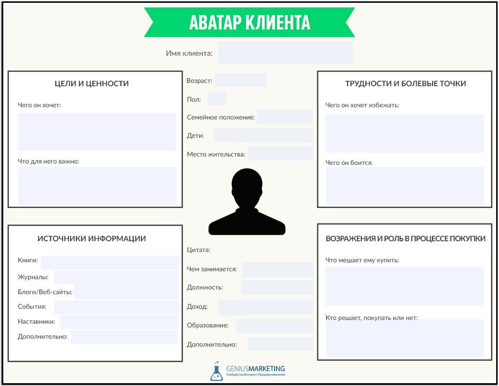
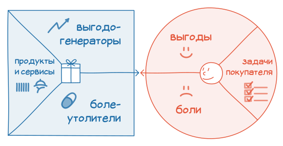
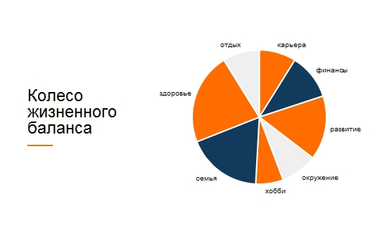
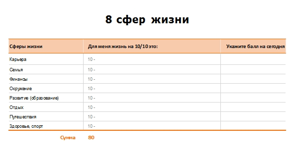
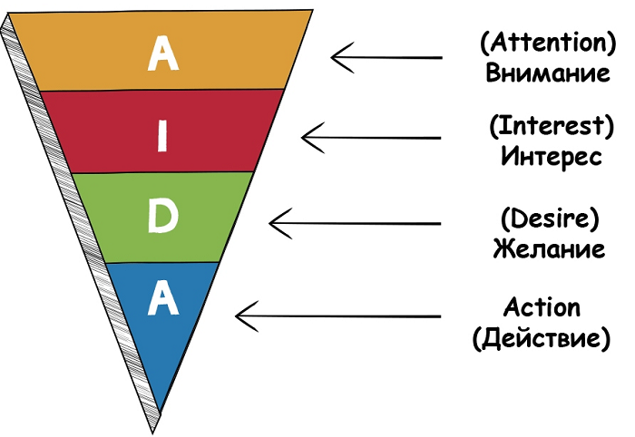
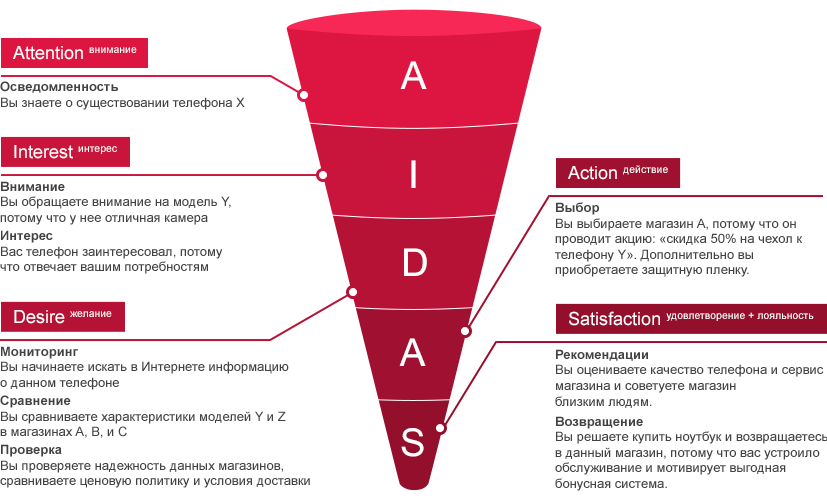

 # Из учебного курса сделать цифровой продукт
**Продукт** - это товар услуга, которую можно предложить для рынка, и которая будет удовлетворять потребности потребителей.
Для того, чтобы мы могли продавать те или иные услуги они должны удовлетворять **потребности потребителей**.  
Потребности у всех разные. Для сегментирования рынка в маркетинге сформулирована такая абстракция как "Целевая аудитория".  
  
**Целевая аудитория** — это группа людей со схожими потребностями и интересами, которые компания может удовлетворить путем реализации своих продуктов.  
  
При работе с курсами нам необходимо представить тех, кто будет пользоваться нашими курсами (школьники, люди, желающие переквалифицироваться в другую сферу, др.).  Для этого лучше всего подходит общение с представителями целевой аудитории, получение у них обратной связи о пользовании продуктом (если продукт уже выведен на рынок).  
  
Но целевая аудитория - это много людей. Для того, чтобы сконцентрироваться на предложении используют технику **"Аватар клиента"**, которая заключается в том, что составляет описание выдуманного человека, который является типичным представителем целевой аудитории.

Благодаря тому, что у нас есть такой вид целевой аудитории - мы сможем создавать предложения и сообщения, которые заинтересовывают.  
Для позиционирования продукта используется техника **Value Proposition Canvas**. С помощью холста (Canvas) мы проходим по шагам, выполняя которые мы формируем полное описание продукта.  

Цель ценностного предложения ответить на два вопроса:
1. Какую из его проблем решает ваш продукт/услуга;
2. Какая уникальная ценность вашего предложения, чем вы выделяетесь на фоне конкурентов? 

|№|Название|Описание|
|---|---|---|
|1|Задачи покупателя|функциональные, социальные, эмоциональные|
|2|Боли|негативные эмоции, нежелательные расходы или риски, которые ваш покупатель переживает при выполнении своих задач. Определите препятствия, которые мешают клиенту выполнить задачи пользователя.|
|3|Выгоды|необходимые, ожидаемые, желательные, неожиданные |
|4|Продукты и сервисы|функциональные, социальные, эмоциональные|
|5|Болеутолители|убирают или уменьшают негативные эмоции, нежелательные расходы и ситуации, снижают риски, с которыми ваши клиенты сталкиваются или могли бы столкнуться при выполнении задач|
|6|Создатели выгод|как продукты и услуги приносят удовлетворение покупателю. Какую приносят пользу, что пользователь ожидает получить? Как достичь этого: через пользу продукта, положительные эмоции, финансовые выгоды?|

[Форма.](https://docs.google.com/document/d/1GxERUPSY_64mGYNj-DojGpz9D8BJvRo2hJt8hwP4pLI/edit?usp=sharing)

 ## Определение запросов учеников.  Маркетинговые технологии в образовании: Value Proposition Canvas. 
 Один из методов определения общих запросов представителей целевой аудитории - составление "колеса жизненного баланса" для всех участников группы, и, в дальнейшем, обощение этих показателей (получить среднее значение).
   

  

[Форма.](https://docs.google.com/spreadsheets/d/1oh_lCdSc--tgyE2wlwZLZHjRSVV_r9M0P4fOKozFtO4/edit#gid=0)  
  
Данная техника позволяет, в итоге, с одной стороны - вывести на осознанный уровень желания учеников. А с другой  - оценить общие тенденции (вычисляя средние показатели). И такое исследование позволяет достаточно хорошо понимать настроения целевой аудитории

 ## Проектирование продукта. 
Когда определены задачи: действия, которые  ведут к достижению поставляенных целей. Для проектирования продукта недостаточно просто скопировать список задач, необходио - представить проект мысленно и составить описния для каждой его части.  

Для проектирования проекта можно взять следующие дейстаия:

 ## Формирование мотивации: воронка продаж и проведение учеников по этапам AIDA. 
В маркетинге используется абстракция AIDA - это описание этапов принятия решений при покупке.  
  
A - attention - Внимание  
I - interest - интерес  
D - desire - желание  
A - action - действие  
  
Если коротко описать такие решения: 
* перед тем, как купить что-то потенциальный клиент должен обратить внимание на предложение о покупке товара (обычно это делается с использованием рекламных объявлений). На уроке - очень важно захватить **внимание** учеников.
* после того, как внимание захвачено - очень важно вызвать интерес (желание знакомиться с характеристиками товара): 
* после того, как сформирован интерес к предлагаемому продукту необходимо сформировать желание (данных продукт купить).
* после того, как потенциальный клиент захотел купить предлагаемый продукт, необходимо обеспечить действие, которое непоследственно и ведет к продаже (получения денег)

Выше перечислены классичкеские элементы модели AIDA. Но в современной прекике добавляют  еще один пункт: S - satisfaacton. Т.е. важно не просто продать, но важно - сформировать удовлетворенности

 ## Современные возможности непрерывной коммуникации с учениками: работа с телеграмм-ботами. 
Для постоянной коммуникации удобно использовать современные инструменты квалификации, телефон, модбильгыыыыыыы

 ## Концепция перевернутого класса.
 В основу данной концепиции положено наблюдение, что занятия, на которых рассказывается теория не отличаются одно от другого. При этом практические занятия для каждой группы уникальны.  
 Поэтому, для донесения ученикам теоретических материалов можно не тратить время дорогостоящего занятия, а все такие материалы записать на видео.  
 Для этого преподаватель должен разобраться со сферой создания видеороликов Дщщьб Вуышптвер и их размещения на видеохостинге.

