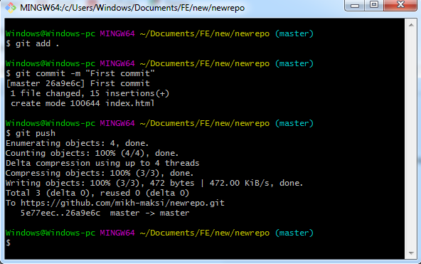
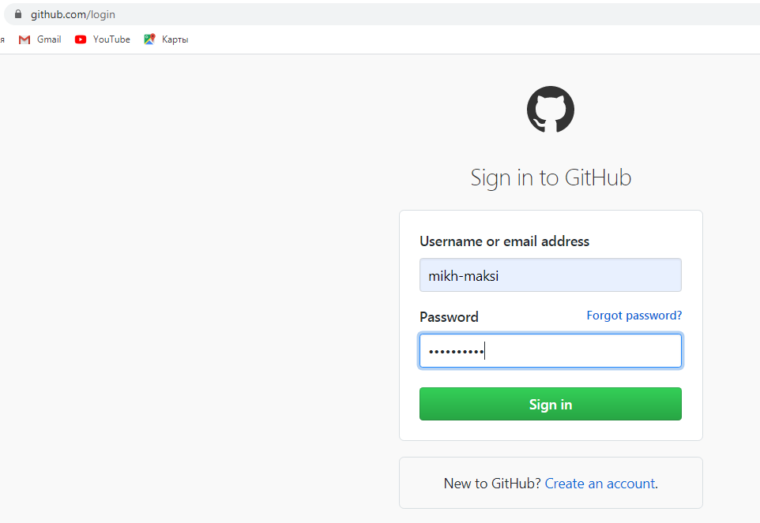

## Принципы работы сознания человека по восприятию: волшебное число семь плюс минус два. 
Далее приведены основые выводы исследования Г. Миллера: 

За один "фрейм" (взгляд) человек запоминает от 5 до 9 элементов (семь плюс минус 2)  

В зависимости от типа информации - способность к ее запоминанию меняется (числа запоминаются лучше, абстракии - хуже)  
Исследования Генри Миллера дают общую картинку и числа, которые он указывает могут варьироваться, в зависимости от уровня подготовки человека в конкретной сфере.  Но в целом данное правило говорит о том, что более 5-7 элементов за один подход не запоминается. И если вам необходимо передавать больше элементов - их необходимо группировать с тем же принципом (количество групп не должно превышать 5-7).

## Теория когнитивной нагрузки. 
Данное направление изучает сложность восприятия информации.  С точки зрения восприятия информации - человек может воспринимать лишь определенный уровень сложности информации (испытывать определенный уровень когнитивной нагрузки).  Естественно, более подготовленные люди, например профессиональные ученые, могут воспринимать намного большие объемы информации, чем обычные люди.

## Проектирование материалов для обучения: использование сервисов. GitHub как хранилище для образовательных материалов.
Современным дефакто стандартом хранения материалов является сервис GitHub. Он удобен тем, что на нем можно хранить кода, а также организовывать совместную работу разработчиков (при которой делается невозможным "перезатирание" работы другого, т.к. все изменения кода сохраняются на GitHub).  
Кроме стандартного использования GitHub как сервиса для хранения кода, его можно использовать как справочник. Эта возможность изначально был добавлена для документирования разрабатываемых проектов. Но, также, с ее помощью можно быстро и удобно размещать методические материалы, при этом ссылаясь на коды (которые размещены на GitHub).

[Инструкция по созданию аккаунта и загрузки файлов](https://docs.google.com/document/d/1SDo3HfqCzmhP031zzwUTtowReGBluG1QHBrETFDJKvg/edit)

**Алгоритм работы с github.com**

Заходим на **github.com** (если не зарегистрированы - зарегистрироваться)

Создаем новый репозитарий

Или используем существующий

Нажимаем кнопку “clone or download”

Создаем новую папку и в ней на пустом месте нажимаем правую клавиши мыши, выбираем gitBush Here (если программа не установлена - скачать:[https://git-scm.com/download/](https://git-scm.com/download/win)

В открывшемся окне пишем   и нажимаем комбинацию клавиш **Shift+INS**

Или нажимаем правой клавишей мыши после набранного **git clone** и выбираем **“Вставить” (Paste)**

Нажимаем “Enter”

Теперь в нашей созданной папке появилась новая под папка с названием таким же как название репозитария (в нашем случае **newrepo**)

Заходим в папку, создаем сайт (файлы index.html, style.css, картинки, шрифты, др.)

Создаем необходимые файлы

Переходим в проводник и нажимаем правой клавишей на пустом месте и выбираем gitbush Here

В открывшимся окне пишем git add . 

Далее - вводим команду **git commit -m "first commit"**

Вводим команду **git push** (возможно - нужно будет указать логин и пароль к git hub)

 
## Карточки занятий.
Одной из важных составляющих занятия, которые позволяют с одной стороны, сделать так, чтобы любой ученик освоил базовый материал. А с другой - чтобы те ученики, которые имеют уровень подготовки выше среднего "не скучали", а имели дополнительные задания. Для этого мы разработали систему карточек урока: когда есть базовое задание и полное объяснение того, как это задание выполнять. А также - есть дополнительные, твореческие и проектные задания:
* Дополнительные задания - по сложности соответствуют базовому (в них необходимо что-то добавить)
* Творческие задания - в них ученики должны, на основе базового задания выполнить задание, которое определяется самим учеником, но с использованием внешних факторов (например, написать с помощью программы свое имя)
* Проетное задание - в нем ученики сами придумываеют условия, описывают их и реализуют.

Как пример: карточки по одному из занятий по курсу "**Программирование в Minecraft**"

# Линии
|#|Название|Альтернативные задания|Код|Результат|
|---|---|---|---|---|
|1|Линия цветов| 1. 6 маков   2. 10 бамбуков   3. 4 саженцев дуба   4. 7 голубых васильков  5. 3 папоротника|||
|2|Линия блоков| 1. 6 блоков стекла   2. 10 блоков взрывчатки   3. 4 блоков тыквы   4. 7 блоков белого бетона  5. 3 кирпичных блока|||
## Специальное задание
С помощью азбуки морзе - написать свое имя.  
 
  
  

## Азбука Морзе
### Команды чата 
Точка  
  
Тире  
  
Пробел    
  
Написание букв командами в чате  
  

### Функции
Тире:  
Создаем функцию  
     
Даем название     
    
Задаем код  
   
   
Точка:   
Создаем функцию  
   
Даем название   
   
Задаем код   
   
Пробел:  
Создаем функцию  
   

Даем название   
   
Задаем код    
   

### Задание и выполнение команды
Создаем команду чата и переносим в нее блоки вызова функций   
   
Задаем требуемую последовательность вызова команд  
    
Вызываем созданную программу (команда чата max)    
    

